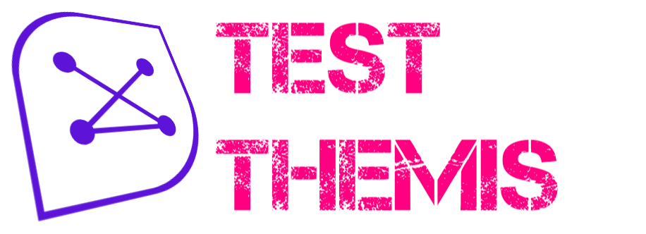

# Projekt TestThemis

Lorem ipsum o projektu
* Themis (řecky Θέμις, latinsky Themis) byla v řecké mytologii dcera boha nebe Úrana a bohyně země Gaie. Šlo o bohyni zákonného pořádku mezi lidmi a v přírodě. Themis byla ztělesněním božského řádu, zákona a zvyku

## Instalace

Je nutné mít připravené:
- pip install flask-restful
- pip install django

## Spuštění webové aplikace
python3 manage.py runserver
* Starting development server at http://127.0.0.1:8000/
* using settings 'mytestsite.settings'
* detaily popsány v https://developer.mozilla.org/en-US/docs/Learn/Server-side/Django/development_environment

## Spuštění API backendu
*TODO

## Součásti projekty:

### api
* https://codeburst.io/this-is-how-easy-it-is-to-create-a-rest-api-8a25122ab1f3
* nutno nainstalovat pip install flask-restful (podporuje python 2 i 3)

### web
* logika web stránek ve frameworku Django
